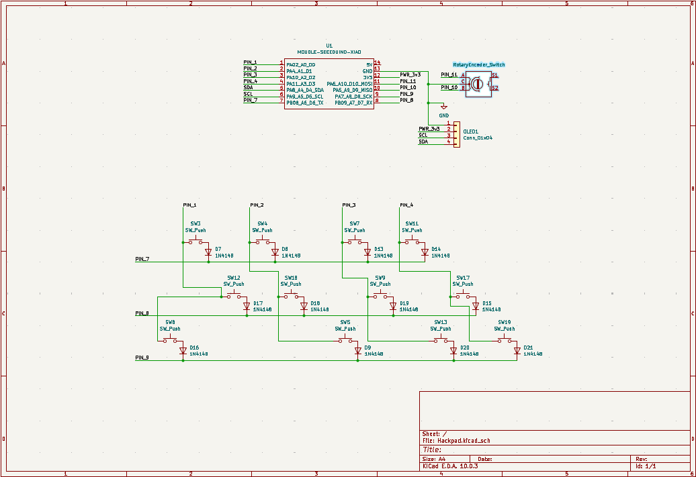
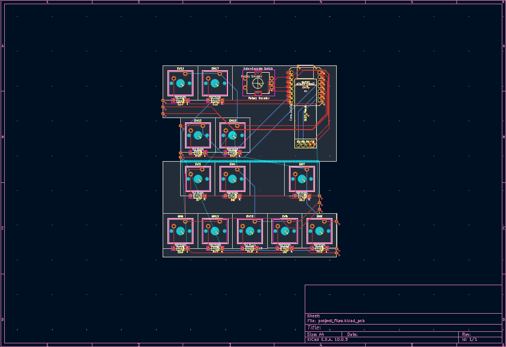

# Hackpiano WIP

A Hackpad, in the form of a piano!

It can serve as a normal macropad too.

## Motivation

I've wanted a MIDI keyboard for a while, and I thought this would be a decent substitute (and a fun challenge!).

This is my first ever project I've made from start to finish, with my own design, so It's very exciting!

I'm hoping to use the skills from this project in others, like my WIP 3d camera (shameless plug)

## Schematic

## PCB

I'm working on the PCB right now. It's been difficult to align everything so the traces are nice, especially since I was forced to wire the keys in a 4x3 grid because of the number of pins

Another BIG problem was that the pcb was too wide. I decided to split the pcb in half and stack the two halves together to get the size requirements, then add breakpoints so I could assemble and solder the pcb together. Thanks to Anicetus for the idea!

