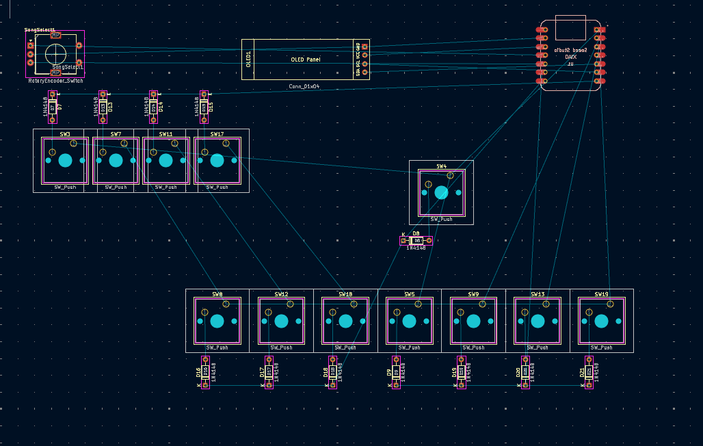

# Hackpiano WIP

A Hackpad, in the form of a piano!

It can serve as a normal macropad too.

I've wanted a MIDI keyboard for a while, and I thought this would be a decent substitute (and a fun challenge!).

This is my first ever project I've made from start to finish, with my own design and stuff, so It's very exciting!

## Schematic

## PCB

I'm working on the PCB right now. It's been difficult to align everything so the traces are nice, especially since I was forced to wire the keys in a 4x3 grid because of the number of pins

